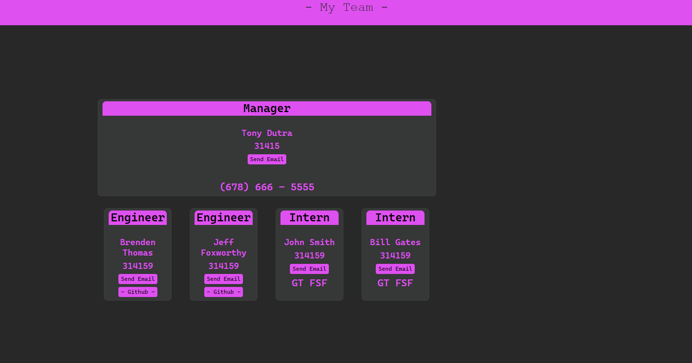

  # Team Profile Generator

  ## Description

  This was developed in mind to better manage your team, while being easily able to click links for github or send an email. As well as to practice my skills in object oriented programming. 

  ## Table of contents

  - [ Link ](#link)
  - [ Screenshot ](#screenshot)
  - [ Installation ](#installation)
  - [ Usage ](#usage)
  - [ Contributions ](#contributions)
  - [ Tests ](#tests)
  - [ Questions ](#questions)
  - [ License ](#license)

  ## Link

  [Click Here](https://github.com/mightjustdie/Team-Profile-Generator) to go to the repo link.

  ## Screenshot

  

  ## Installation

  Simply fork the repository, clone it down to your local machine then in the CLI while at the relative directory, use 'npm i' to intall all dependancies in the package-json. 

  ## Usage

  In order to run the script after installing depandancies in the step above in the CLI at relative directory use 'node index.js' to start the script. Then follow the prompts untill you have no more team members to add then you can select the prompt that asks if you wish to add an additional team member, select 'No'. Then the HTML file will auto generated inside of the dist folder. 

  ## Contributions

  How to contribute?: 
  To contribute follow ensure that your code is using best practices and naming conventions for varibales, please ensure that your code is commented as well. Then create a pull request. In the request detail the reason for the change and all changes made as well as why these changes would benefit the project or what bugs were found and fixed, and how to recreate these bugs. Pull requests that do not follow this format will not be reviewed or accepted. 

  ## Tests

  This application is using jest , to start a test, use command 'npm test' in CLI at 
  _ _test_ _ directory. To write a test add files under the same _ _test_ _ folder.

  ## Questions

  Github - Brenden T. - https://github.com/mightjustdie

  Email - brenthomas02@gmail.com

  ## License

  MIT  

   To see full details visit https://opensource.org/license/mit/

   Preview... 

      Permission is hereby granted, free of charge, to any person obtaining a copy of this software and associated documentation files (the “Software”), to deal in the Software without restriction, including without limitation the rights to use, copy, modify, merge, publish, distribute, sublicense, and/or sell copies of the Software, and to permit persons to whom the Software is furnished to do so, subject to the following conditions:

      The above copyright notice and this permission notice shall be included in all copies or substantial portions of the Software.

      THE SOFTWARE IS PROVIDED “AS IS”, WITHOUT WARRANTY OF ANY KIND, EXPRESS OR IMPLIED, INCLUDING BUT NOT LIMITED TO THE WARRANTIES OF MERCHANTABILITY, FITNESS FOR A PARTICULAR PURPOSE AND NONINFRINGEMENT. IN NO EVENT SHALL THE AUTHORS OR COPYRIGHT HOLDERS BE LIABLE FOR ANY CLAIM, DAMAGES OR OTHER LIABILITY, WHETHER IN AN ACTION OF CONTRACT, TORT OR OTHERWISE, ARISING FROM, OUT OF OR IN CONNECTION WITH THE SOFTWARE OR THE USE OR OTHER DEALINGS IN THE SOFTWARE.
